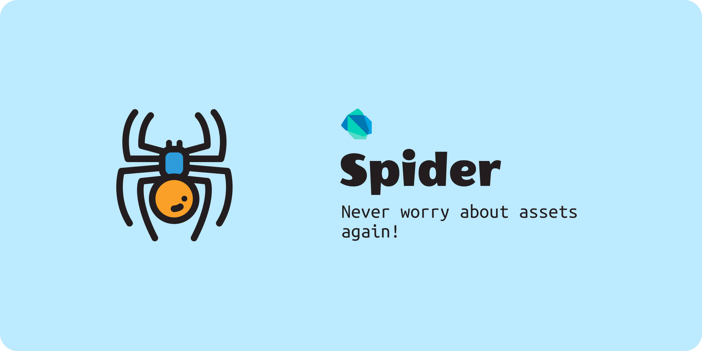

# Spider

A small dart library to generate Assets dart code from assets folder.
It generates dart class with static const variables in it which can be used to reference
the assets safely anywhere in the flutter app.

### Example

#### Before
```dart
Widget build(BuildContext context) {
  return Image(image: AssetImage('assets/background.png'));
}
```

#### After
```dart
Widget build(BuildContext context) {
  return Image(image: AssetImage(Assets.background));
}
```

#### Generated Assets Class
```dart
class Assets {
  static const String background = 'assets/background.png';
}
```

This method allows no error scope for string typos. Also, it provides auto-complete
in the IDE which comes very handy when you have large amount of assets.

## Installation

This is package is an independent library that is not linked to your project. So there's no need to add it to your flutter project as it works as a global command line tool for all of your projects.

```shell
pub global activate spider
```

Run following command to see help:

```shell
spider --help
```

## Usage

### Using default configuration
By default, Spider will look for assets in 'assets' folder and will generate Dart
class with name `Assets` in 'lib/res/assets.dart' file.

#### Default Configs
```yaml
path: assets
class_name: Assets
package: res
```

### Allowed File Extensions

```
jpeg | jpg | png | gif | ico | svg | ttf | eot | woff | woff2
```

### Customize Configuration
To use custom configurations, Spider searches for a yaml file named 'spider.yaml' or 'spider.yml' in the
root directory of the flutter project. see default configs block for information on available configurations.

#### Create Configuration File
Spider provides a very easy and straight forward way to create a configuration file.
Execute following command and it will create a configuration file with default configurations in it.

```shell
spider create
```

Now you can modify available configurations and Spider will use those configs when generating dart code.

#### Use JSON config file

Though above command creates `YAML` format for config file, spider also supports `JSON` format for config file. Use this command to create `JSON` config file instead of `YAML`.

```shell
spider create --json
```

No matter which config format you use, `JSON` or `YAML`, spider automatically detects it and uses it for code generation.

see help for more information:
```shell
spider create --help
```

### Generate Code

Run following command to generate dart code:

```shell
spider build
```

### Watch Directory
Spider can also watch given directory for changes in files and rebuild dart code automatically. Use following command to watch for changes:

```shell
spider build --watch
```

see help for more information:
```shell
spider build --help
```

## Advanced Configuration
Spider provides supports for multiple configurations and classifications. If you wanna group your assets by module, type or anything, you can do that using `groups` in spider.

### Example
Suppose you have both vector(SVGs) and raster images in your project and you want to me classified separately so that you can use them with separate classes. You can use groups here. Keep your vector and raster images in separate folder and specify them in the config file.

`spider.yaml`
```yaml
groups:
  - path: assets/images
    class_name: Images
    package: res
  - path: assets/vectors
    class_name: Svgs
    package: res
```

Here, first item in the list indicates to group assets of `assets/images` folder under class named `Images` and the second one indicates to group assets of `assets/vectors` directory under class named `Svgs`. 

So when you refer to `Images` class, auto-complete suggests raster images only and you know that you can use them with `AssetImage` and other one with vector rendering library.

## License
```
Copyright © 2020 Birju Vachhani

Licensed under the Apache License, Version 2.0 (the "License");
you may not use this file except in compliance with the License.
You may obtain a copy of the License at

    http://www.apache.org/licenses/LICENSE-2.0

Unless required by applicable law or agreed to in writing, software
distributed under the License is distributed on an "AS IS" BASIS,
WITHOUT WARRANTIES OR CONDITIONS OF ANY KIND, either express or implied.
See the License for the specific language governing permissions and
limitations under the License.
```
