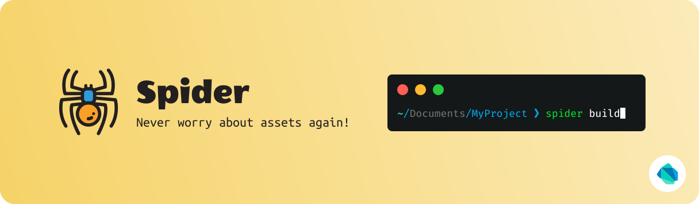

# Spider

A small dart **command-line tool** to generate Assets dart code from assets folder. It generates dart class with **static const** variables in it which can be used to reference the assets **safely** anywhere in the flutter app.

[](https://github.com/BirjuVachhani/spider/actions) [](https://pub.dev/packages/spider)

## Breaking Changes since v1.0.0:

> Instead of declaring `package` name separately for each group, spider now takes `package` key-value pair as a global configuration.

## What it does?

Spider generates references for the local assets used in your project by creating dart referece classes which are safe and easy to use anywhere.

**Example**

Before

```dart
Widget build(BuildContext context) {
  return Image(image: AssetImage('assets/background.png'));
}
```

After

```dart
Widget build(BuildContext context) {
  return Image(image: AssetImage(Assets.background));
}
```

Generated Assets Class

```dart
class Assets {
  static const String background = 'assets/background.png';
}
```

## Why Spider?

- Lightening fast code generation.
- Safe access to assets. No more typos!
- IDE auto-complete support.
- No dependecy on the project.
- Easy to configure.
- Way more customizable.
- Supports tests generation.
- Less VCS noise.
- Import friendly (exportable as library).
- Well documented.

**Sounds interesting?** 

Head over to [Getting Started](installation.md) guide and try out the power of Spider.

## Liked spider?

Show some love and support by starring the [repository](https://github.com/birjuvachhani/spider).

Or You can

<a href="https://www.buymeacoffee.com/birjuvachhani" target="_blank"></a>


## License

```
Copyright © 2020 Birju Vachhani

Licensed under the Apache License, Version 2.0 (the "License");
you may not use this file except in compliance with the License.
You may obtain a copy of the License at

    http://www.apache.org/licenses/LICENSE-2.0

Unless required by applicable law or agreed to in writing, software
distributed under the License is distributed on an "AS IS" BASIS,
WITHOUT WARRANTIES OR CONDITIONS OF ANY KIND, either express or implied.
See the License for the specific language governing permissions and
limitations under the License.
```
